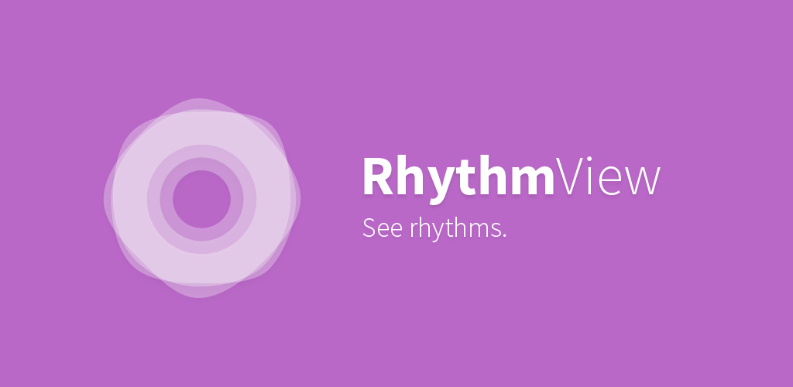
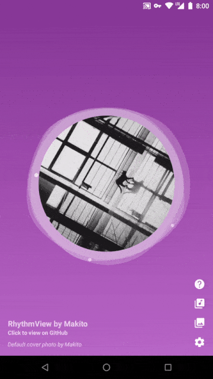

[](https://jitpack.io/#SumiMakito/RhythmView)
[](https://github.com/SumiMakito/RhythmView/releases/latest)
[](https://github.com/SumiMakito/RhythmView/blob/master/LICENSE)


RhythmView - Visualizes rhythms for you.


### Demo app

<a href="https://play.google.com/store/apps/details?id=com.github.sumimakito.rhythmview" target="_blank"></a>


### Preview




### Quick start

#### 1. Add the dependency

Firstly, add lines below in the project-level build.gradle:

```
allprojects {
    repositories {
        ...
        maven { url 'https://jitpack.io' }
    }
}
```

Then, add lines below in the module-level build.gradle:

> Replace `<VERSION>` with the latest version name.

```
dependencies {
    compile 'com.github.SumiMakito:RhythmView:<VERSION>'
}
```

#### 2. Add the view to a layout

> RhythmView does not have custom attributes in the XML layout.

```xml
<com.github.sumimakito.rhythmview.RhythmView
    android:id="@+id/rhythmView"
    android:layout_width="300dp"
    android:layout_height="300dp"
    android:padding="30dp" />
```

#### 3. Access in Java/Kotlin code

```kotlin
// Kotlin
rhythmView.onRhythmViewLayoutChangedListener = { view: RhythmView ->
    // ... setup RhythmView
}      
```

```java
// Java
rhythmView.setOnRhythmViewLayoutChangedListener(view -> {
    // ... setup RhythmView
});
```

### Example: Ripple & PlaybackSource

```java
// Java
...
public class PlayerActivity extends Activity {
    private MediaPlayer mediaPlayer; // to avoid the MediaPlayer being collected by GC
    private boolean mediaPlayerInitialized = false;
    ...
    @Override
    protected void onCreate(Bundle savedInstanceState) {
        super.onCreate(savedInstanceState);
        ...
        int resolution = 8;
        ...
        // the listener will be triggered every time RhythmView's onLayout() is called,
        // data source and visual effect SHOULD be re-initialized in response to layout
        // changes
        rhythmView.setOnRhythmViewLayoutChangedListener(view -> {
            // initialize the MediaPlayer only once
            if(!mediaPlayerInitialized){
                mediaPlayer = MediaPlayer.create(this, R.raw.music);
                mediaPlayer.setLooping(true);
            }
            // initialize the preset data source
            PlaybackSource dataSource = new PlaybackSource(mediaPlayer, resolution);
            // initialize the visual effect
            Ripple ripple = new Ripple(rhythmView, 8);
            // set colors for high, medium, low frequencies and particles
            ripple.setColorHF(0xffef9a9a);
            ripple.setColorMF(0xffef9a9a);
            ripple.setColorLF(0xffef9a9a);
            ripple.setColorParticle(0xffef9a9a);
            // set the data source for the visual effect
            ripple.setDataSource(dataSource);
            // start the playback only once
            if(!mediaPlayerInitialized){
                mediaPlayer.start();
                mediaPlayerInitialized = true;
            }
        });
        // set the album cover (this operation can be done outside the listener)
        rhythmView.setAlbumCover(coverBitmap);
        ...
    }
    ...
    @Override
    protected void onDestroy() {
        super.onDestroy();
        // remember to release the MediaPlayer instance
        mediaPlayer.release();
    }
    ...
}
```

```kotlin
// Kotlin
...
class PlayerActivity : Activity() {
    private var mediaPlayer: MediaPlayer? = null // to avoid the MediaPlayer being collected by GC
    private var mediaPlayerInitialized = false
    ...
    override fun onCreate(savedInstanceState: Bundle) {
        super.onCreate(savedInstanceState)
        ...
        val resolution = 8
        ...
        // the listener will be triggered every time RhythmView's onLayout() is called,
        // data source and visual effect SHOULD be re-initialized in response to layout
        // changes
        rhythmView.onRhythmViewLayoutChangedListener = { view: RhythmView ->
            // initialize the MediaPlayer only once
            if (!mediaPlayerInitialized) {
                mediaPlayer = MediaPlayer.create(this, R.raw.music)
                mediaPlayer!!.setLooping(true)
            }
            // initialize the preset data source
            val dataSource = PlaybackSource(mediaPlayer!!, resolution)
            // initialize the visual effect
            val ripple = Ripple(view, 8)
            // set colors for high, medium, low frequencies and particles
            ripple.colorHF = 0xffef9a9a
            ripple.colorMF = 0xffef9a9a
            ripple.colorLF = 0xffef9a9a
            ripple.colorParticle = 0xffef9a9a
            // set the data source for the visual effect
            ripple.dataSource = dataSource
            // start the playback only once
            if (!mediaPlayerInitialized) {
                mediaPlayer!!.start()
                mediaPlayerInitialized = true
            }
        }
        // set the album cover (this operation can be done outside the listener)
        rhythmView.albumCover = coverBitmap
        ...
    }
    ...
    override fun onDestroy() {
        super.onDestroy()
        // remember to release the MediaPlayer instance
        mediaPlayer!!.release()
    }
    ...
}
```

### Metrics & Specs

```
innerWidth = width - paddingLeft - paddingRight
innerHeight = height - paddingTop - paddingBottom

innerSize = min(innerWidth, innerHeight)

centerX = paddingLeft + innerWidth * 0.5
centerY = paddingTop + innerHeight * 0.5

maxDrawingWidth = innerSize * maxDrawingWidthScale * 0.5
radius = (innerSize - 2 * maxDrawingWidth - 2 * innerDrawingPaddingScale * innerSize) * 0.5
minDrawingRadius = radius + innerDrawingPaddingScale * innerSize
```

### API definitions

#### RhythmView

###### coverSpinningSpeed

*Type: Float*

*Default: 0.5f*

*Unit: Degrees per frame*

To control the spinning speed of the cover image. 

Positive value for CW spinning. Negative value for CCW spinning.

###### isPaused

*Type: Boolean*

*Default: false*

If true, the cover will stop spinning.

*To stop the visual effect, please try to stop the MediaPlayer instance bind with the data source.*

###### showFpsCounter

*Type: Boolean*

*Default: false*

If true, an FPS counter will display at the top left corner of the view.

###### innerDrawingPaddingScale

*Type: Float*

*Default: 0.01f*

###### maxDrawingWidthScale

*Type: Float*

*Default: 0.24f*

###### albumCover

*Type: Bitmap(?Kotlin)*

*Default: null*

The cover image for the RhythmView. Will display in a round shape.

Square images are recommended. Set to null to disable.

Non-square-shaped images will be resized and fit in to a squared area for clipping.

### Donation

Claps for everyone who offers support. Cheers!

You can donate by [PayPal](https://www.paypal.me/makito) or [Alipay](https://qr.alipay.com/a6x02021re1jk4ftcymlw79).

### License


RhythmView is available under the Apache-2.0 license. 

See the LICENSE file for more info.

Copyright &copy; 2017-2018 Makito.